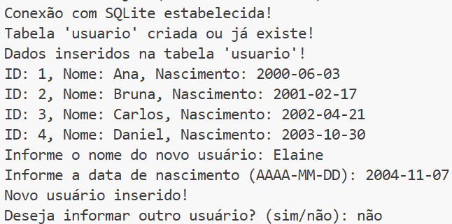
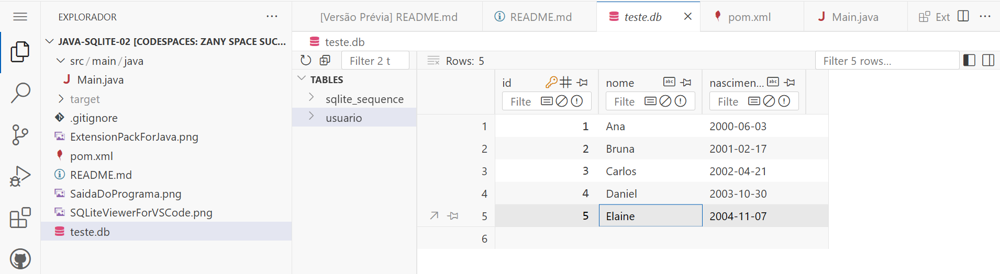

# java-sqlite-02

1) Criar um repositório público para o projeto no `GitHub`. Ao criar o projeto, marcar as opções `Public` e `Add a README file`. No item `Add .gitignore`, selecionar a opção `Maven`. Em seguida, clicar no botão `Code` e iniciar um `Codespace` clicando em `Create a codespace on main`.

2) No `Codespace`, instalar a extensão (plugin) VS Code `SQLite Viewer for VS Code`:


3) No `Codespace`, criar a estrura de diretório:
```
  src/main/java
```

4) Criar o arquivo `Main.java` dentro de `src/main/java` com o conteúdo abaixo:
```java
import java.sql.Connection;
import java.sql.DriverManager;
import java.sql.ResultSet;
import java.sql.Statement;

public class Main {
    public static void main(String[] args) {
        Connection connection = null;

        try {
            // Conectar ao banco de dados SQLite:
            connection = DriverManager.getConnection("jdbc:sqlite:teste.db");
            System.out.println("Conexão com SQLite estabelecida!");

            // Criar uma tabela (usuario):
            String createTableSQL = 
            """
               CREATE TABLE IF NOT EXISTS usuario (
                  id INTEGER PRIMARY KEY AUTOINCREMENT, 
                  nome VARCHAR(256) NOT NULL, 
                  nascimento TEXT
               );
            """;

            // Criar e executar uma declaração SQL:
            Statement statement = connection.createStatement();
            statement.execute(createTableSQL);
            System.out.println("Tabela 'usuario' criada ou já existe.");

            // Inserir dados na tabela 'usuario':
            String insertSQL = 
            """
               INSERT INTO usuario (nome, nascimento) VALUES 
               ('Ana', '2000-06-03'), 
               ('Bruna', '2001-02-17'),
               ('Carlos', '2002-04-21'),
               ('Daniel', '2003-10-30');
            """;
            statement.execute(insertSQL);
            System.out.println("Dados inseridos na tabela 'usuario'.");

            // Consultar dados da tabela 'usuario':
            String selectSQL = "SELECT * FROM usuario;";
            ResultSet resultSet = statement.executeQuery(selectSQL);
            while (resultSet.next()) {
                System.out.println("ID: " + resultSet.getInt("id") + 
                                   ", Nome: " + resultSet.getString("nome") +
                                   ", Nascimento: " + resultSet.getString("nascimento"));
            }
        } catch (Exception e) {
            e.printStackTrace();
        } finally {
            try {
                if (connection != null) {
                    connection.close();
                }
            } catch (Exception e) {
                e.printStackTrace();
            }
        }
    }
}
```

5) Criar o arquivo `pom.xml` com o conteúdo abaixo para projetos que usam `Maven` no diretório raiz do projeto:
```xml
<project xmlns="http://maven.apache.org/POM/4.0.0" xmlns:xsi="http://www.w3.org/2001/XMLSchema-instance" xsi:schemaLocation="http://maven.apache.org/POM/4.0.0 http://maven.apache.org/xsd/maven-4.0.0.xsd">
    <modelVersion>4.0.0</modelVersion>

    <groupId>com.exemplo</groupId>
    <artifactId>meu-projeto</artifactId>
    <version>1.0-SNAPSHOT</version>

    <properties>
        <maven.compiler.source>15</maven.compiler.source>
        <maven.compiler.target>15</maven.compiler.target>
    </properties>

    <dependencies>
        <dependency>
            <groupId>org.xerial</groupId>
            <artifactId>sqlite-jdbc</artifactId>
            <version>3.34.0</version>
        </dependency>
    </dependencies>

    <build>
        <plugins>
            <plugin>
                <groupId>org.apache.maven.plugins</groupId>
                <artifactId>maven-compiler-plugin</artifactId>
                <version>3.8.1</version>
                <configuration>
                    <source>15</source>
                    <target>15</target>
                </configuration>
            </plugin>
            <plugin>
                <groupId>org.codehaus.mojo</groupId>
                <artifactId>exec-maven-plugin</artifactId>
                <version>1.6.0</version>
                <executions>
                    <execution>
                        <goals>
                            <goal>java</goal>
                        </goals>
                    </execution>
                </executions>
                <configuration>
                    <mainClass>Main</mainClass>
                </configuration>
            </plugin>
        </plugins>
    </build>
</project>

```
 
 6) Instalar todas as dependências do projeto `Maven` listadas no arquivo `pom.xml`:
```
  mvn clean install
```

 7) Compilar o projeto:
 ```
  mvn clean compile
 ```

 8) Executar o projeto:
 ```
  mvn exec:java -Dexec.mainClass="Main"
 ```
 
 9) Saída:
 
 

 10) Clicar no arquivo `teste.db`. No painel lateral direito, clicar na tabela `usuario`. Observar os registros inseridos na tabela:
